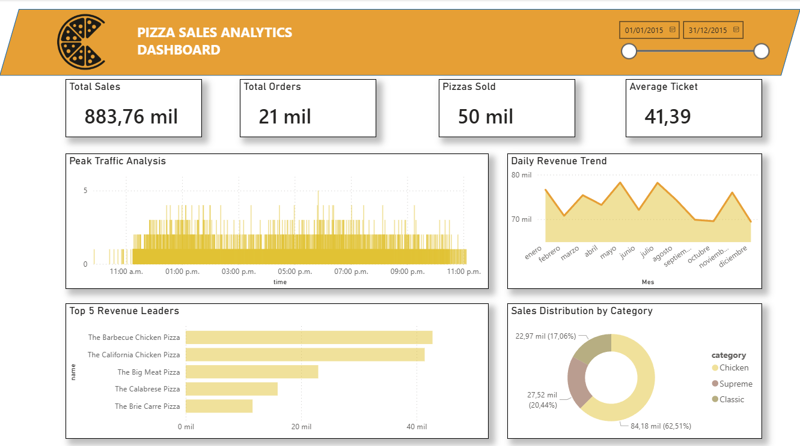

# 🍕 Pizza Sales Relational Analysis (2015)



*(Vista previa del Dashboard)*

## 📌 Resumen del Proyecto
Este proyecto se enfoca en el **Análisis de un Modelo de Datos Normalizado**. El objetivo principal es evaluar el rendimiento del menú y la eficiencia operativa de un restaurante de pizzas, utilizando consultas complejas para unir datos de múltiples tablas.

**Pregunta de Negocio:** ¿Cuál es la composición de la venta (Categoría, Tamaño), cuál es el mejor momento para contratar personal y qué productos maximizan los ingresos?

---

## 🛠️ Tech Stack & Flujo de Trabajo

Este proyecto se centra en la habilidad para construir y consultar un modelo de datos relacional.

### 1. SQL Server (Modelado Relacional)
* **Objetivo:** Demostrar el manejo de un modelo de datos normalizado (Star/Snowflake Schema).
* **Modelado:** Creación de 4 tablas interconectadas (`orders`, `order_details`, `pizzas`, `pizza_types`) con `PRIMARY KEY` y `FOREIGN KEY` (PK/FK).
* **ETL & Data Cleansing:** Desarrollo de un script de migración que soluciona errores de formato numérico (`1275` → `12.75`) causados por la inconsistencia de los datos fuente.
* **Análisis Avanzado:** Uso extensivo de **`INNER JOIN`** (3 y 4 tablas) para calcular Ingresos por Categoría y **`WINDOW FUNCTIONS`** (`RANK`, `SUM() OVER`) para calcular las ventas acumuladas.

### 2. Power BI
* **Conexión:** Conexión directa a la base de datos `Pizza_DB`.
* **Modelado:** Configuración manual de las relaciones en el entorno de BI.
* **Visualización de KPIs:** Dashboard de una sola página con enfoque en **Horas Pico** (para gestión de personal) y **Ticket Promedio** (para rentabilidad).
---

## 📊 Hallazgos Clave (Key Insights)

1.  **Ventas Totales:** La Categoría **Clásica** (Classic) es la que genera la mayor cantidad de ingresos, aunque la categoría **Supreme** tiene un Ticket Promedio más alto.
2.  **Operaciones:** La hora pico de pedidos se concentra entre las **5:00 pm** y **9:00 pm**.
    * *Recomendación:* Se requiere aumentar el personal de cocina y reparto en ese rango horario.
3.  **Rentabilidad:** La pizza **The Barbecue Chicken Pizza** es la que impulsa los ingresos del restaurante.

---

## 📂 Estructura del Repositorio

```text
Pizza_Sales_Relational_Analysis/
├── data/                  # Datasets originales (CSV)
├── sql/                   # Scripts SQL (Schema, ETL, Queries)
├── powerbi/               # Dashboard (.pbix)
└── README.md              # Documentación del proyecto
